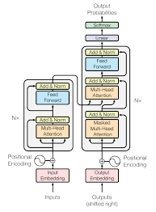

# Attention based language model
Implement a language model from a very simple model to implement the architecture which introduced in [Attention Is All You Need](https://arxiv.org/abs/1706.03762) paper. 
[google colab link](https://colab.research.google.com/github/alireza-sheikh/Language-model/blob/main/Language_model.ipynb)  

  
As this is a language model we don't implement encoder part.  
This repository is based on a [tutorial](https://www.youtube.com/watch?v=kCc8FmEb1nY) from Andrej Karpathy.  
Dataset: [Tiny Shakespeare dataset](https://raw.githubusercontent.com/karpathy/char-rnn/master/data/tinyshakespeare/input.txt)  
We start with bigram language model which is a very simple model, and by 7 steps convert it to a powerful model these 
steps are implemented in code and we can see how each step effects on the model's result.  
1. Bigram language model
2. Add single head self attention module to model
3. Add multi head attention module to model
4. Add feed forward module
5. Create feed forward and multi head attention blocks and repeat them in the model
6. Add skip connection and layer normalization
7. Add dropout
